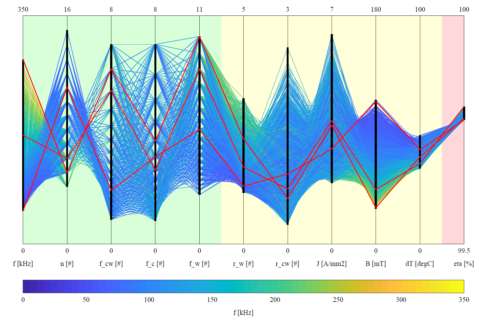

# Parallel Coordinates Plot with MATLAB

This **MATLAB** tool makes **parallel coordinates plots**.
Parallel coordinates plots allows the **visualization of high-dimensional data**.

The following features are implemented: 
* Filering and sorting of the variables
* Scaling of the range of the variables
* Find the color of the lines composing the plot
* Extract and highlight special lines
* Plot the ranges of the different variables

The tool is able to handle large amount of data:
* For large datasets, a single vector plot is generated
* For large datasets, a vector plot is generated with the axis and a raster plot with the data

This tool is developed by the **Power Electronic Systems Laboratory at ETH Zurich** and is available under the **BSD License**. The code is also available on the ETH Data Archive.

## Example

In the example, the design space diversity of a medium-frequency transformer is considered:
* [run_parse.m](run_parse.m) - Extract and parse the dataset
* [run_plot.m](run_plot.m) - Make the parallel coordinate plot

    

## Compatibility

The tool is tested with the following MATLAB setup:
* Tested with MATLAB R2018b or 2019a
* No toolboxes are required.
* Compatibility with GNU Octave not tested but probably easy to achieve.

## Author

* **Thomas Guillod, ETH Zurich, Power Electronic Systems Laboratory** - [GitHub Profile](https://github.com/otvam)

## License

* This project is licensed under the **BSD License**, see [LICENSE.md](LICENSE.md).
* This project is copyrighted by: (c) 2016-2020, ETH Zurich, Power Electronic Systems Laboratory, T. Guillod.
